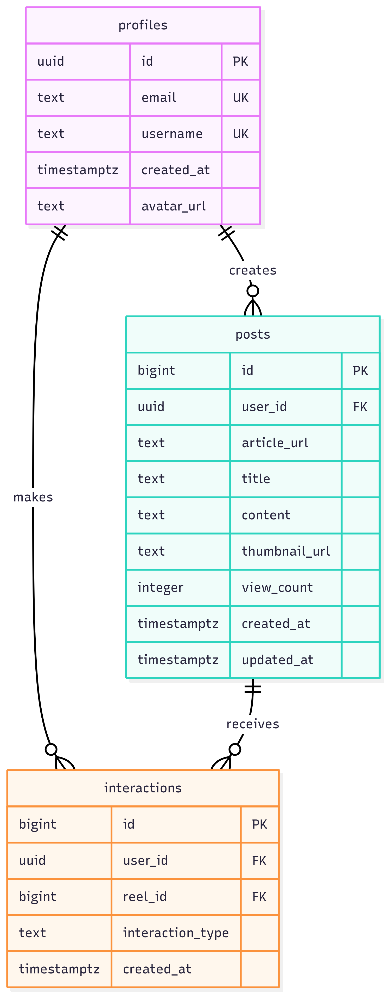

# BetterFeed

A smart feed application for scrolling through condensed academic articles presented in a TikTok-style interface. Users can discover, interact with, and save articles from a curated feed powered by real news data.

**Note**: Currently using NewsAPI as a placeholder data source. Future versions will integrate with academic article APIs and include AI-powered article summarization.

## Features

- 📱 **Smart Feed**: Scroll through condensed articles in a mobile-friendly interface
- 👤 **User Profiles**: Create and customize user profiles with avatars
- ❤️ **Interactions**: Like and save articles for later reading
- 📊 **Engagement Metrics**: View counts and interaction statistics
- 🔒 **Secure**: Row Level Security (RLS) policies ensure data privacy

## Database Design

### Overview

The database is designed to support a social media-style feed application with three core entities:

1. **Profiles**: User accounts with unique identifiers and social metadata
2. **Posts**: Article content with engagement metrics and metadata
3. **Interactions**: User engagement (likes/saves) with foreign key constraints

All tables use Row Level Security (RLS) to ensure users can only modify their own data while allowing public read access for the feed experience.

### Entity Relationship Diagram



### Tables Description

#### **profiles**
Stores user profile information linked to Supabase Auth.

- `id` (UUID): Primary key, links to auth.users
- `email` (TEXT): Unique user email
- `username` (TEXT): Unique username for display
- `avatar_url` (TEXT): URL to user's avatar image
- `created_at` (TIMESTAMPTZ): Account creation timestamp

#### **posts**
Stores article content and metadata for the feed.

- `id` (BIGINT): Auto-incrementing primary key
- `user_id` (UUID): Foreign key to profiles (creator)
- `article_url` (TEXT): URL to the original article
- `title` (TEXT): Article title (max 100 chars in seed data)
- `content` (TEXT): Article summary
- `thumbnail_url` (TEXT): URL to article thumbnail image
- `view_count` (INTEGER): Number of views (default 0)
- `created_at` (TIMESTAMPTZ): Post creation time
- `updated_at` (TIMESTAMPTZ): Last update time (auto-updated via trigger)

**Indexes**:
- `idx_posts_user_id`: Faster queries by user
- `idx_posts_created_at`: Optimized for chronological feed ordering

#### **interactions**
Tracks user engagement with posts (likes and saves).

- `id` (BIGINT): Auto-incrementing primary key
- `user_id` (UUID): Foreign key to profiles
- `post_id` (BIGINT): Foreign key to posts
- `interaction_type` (TEXT): Either 'like' or 'save'
- `created_at` (TIMESTAMPTZ): Interaction timestamp

**Constraints**:
- Unique constraint on (user_id, post_id, interaction_type) - prevents duplicate interactions
- Check constraint ensures interaction_type is either 'like' or 'save'

**Indexes**:
- `idx_interactions_user_id`: Faster user activity queries
- `idx_interactions_post_id`: Faster engagement metric calculations

### Security Model

All tables implement Row Level Security (RLS) with the following policies:

#### **Profiles Policies**
- ✅ **Public Read**: Anyone can view all profiles (public app)
- ✅ **Self Insert**: Users can only create their own profile (auth.uid() = id)
- ✅ **Self Update**: Users can only update their own profile

#### **Posts Policies**
- ✅ **Public Read**: Anyone can view all posts (public feed)
- ✅ **Authenticated Insert**: Only authenticated users can create posts
- ✅ **Self Update**: Users can only update their own posts
- ✅ **Self Delete**: Users can only delete their own posts

#### **Interactions Policies**
- ✅ **Public Read**: Anyone can view interactions (for engagement metrics)
- ✅ **Self Insert**: Users can only create their own interactions
- ✅ **Self Delete**: Users can only delete their own interactions

**Security Notes**:
- The service key bypasses RLS (used only for seeding)
- The anon key respects RLS (used in production/testing)
- All write operations require authentication
- ON DELETE CASCADE ensures referential integrity

## Setup Instructions

### Prerequisites

- Python 3.10 or higher
- Supabase account with a project created
- NewsAPI account and API key (free tier works)

### Running the test scripts

1. Clone the Repository

```bash
git clone <repository-url>
cd team-6-reels
```

2. Set Up Python Environment

```bash
# Install dependencies
pip install -r requirements.txt
```

3. Configure Environment Variables

Create a `.env` file in the project root:

```env
SUPABASE_URL=https://your-project.supabase.co
SUPABASE_ANON_KEY=your-anon-key-here
SUPABASE_SERVICE_KEY=your-service-role-key-here
NEWS_API_KEY=your-newsapi-key-here
```

4. Set Up Database Schema (do this only if you haven't been provided with the ENV from our team)

In your Supabase project dashboard:

- Go to the **SQL Editor**
- Copy the contents of `sql/schema.sql`
- Execute the SQL to create tables, indexes, and RLS policies

5. Seed the Database (similarly, do this only if you are bringing your own ENV)

Run the seed script to populate your database with real article data:

```bash
python seed.py
```

6. Test the Connection

Verify everything is working:

```bash
python test_connection.py
```

This comprehensive test suite will:
1. ✅ Read all profiles
2. ✅ Query posts with JOIN operations
3. ✅ Analyze interaction statistics
4. ✅ Find most popular posts
5. ✅ Verify RLS policies are working
6. ✅ Check article URLs
7. ✅ Identify most active users
8. ✅ Calculate engagement metrics
